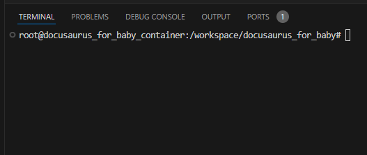

Content of blog1/post-1

It is content before the markdown `<!--` `truncate` `-->`

<!-- truncate -->

Content of blog1/post-1 after `<!-- truncate -->`

## Math Equations

https://docusaurus.io/docs/markdown-features/math-equations

$$
I = \int_0^{2\pi} \sin(x)\,dx
$$

## Search + 中文

https://github.com/easyops-cn/docusaurus-search-local

中文

## Image

